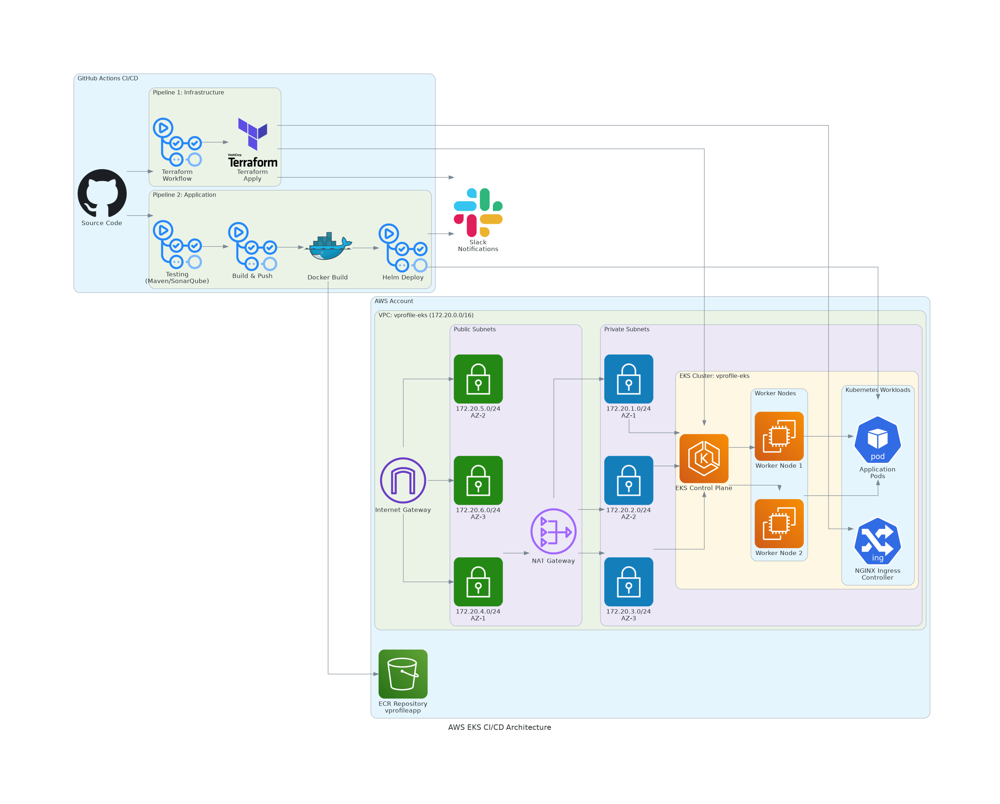

# 🚀 Vprofile Application CI/CD

This repository contains the **CI/CD pipeline** for building, testing, scanning, containerizing, and deploying the **Vprofile application** on AWS **EKS** using **GitHub Actions, Docker, Helm, and SonarQube**.

---

## 🏗️ Architecture

---

## 🎥 Demo Video

Watch the complete CI/CD pipeline execution and application deployment demo below:

This video demonstrates:
- End-to-end CI/CD pipeline execution using GitHub Actions
- Configured Ingress for deployed applications and resolved CNAME records in DNS to enable proper host routing

---

## 🔹 CI/CD Workflow: `vprofile actions`

### **Jobs Overview**
1. **Testing**
   - Run unit tests with Maven (`mvn test`)
   - Code style checks (`mvn checkstyle:checkstyle`)
   - Run **SonarQube Scan** and enforce Quality Gate

2. **Build & Publish**
   - Build Docker image
   - Push image to **AWS ECR** (`vprofileapp`)

3. **Deploy to EKS**
   - Update kubeconfig for `vprofile-eks` cluster
   - Create Kubernetes ECR secret
   - Deploy Helm chart (`vprofilecharts`) to the cluster

4. **Slack Notification**
   - Always runs (reports **success** ✅ or **failure** ❌)

---

## 🛠️ Tools & Services Used
- **Java + Maven** → Unit testing and build
- **SonarQube / SonarCloud** → Code quality & security scan
- **Docker + AWS ECR** → Containerization and image registry
- **Helm + EKS** → Kubernetes application deployment
- **GitHub Actions** → CI/CD automation
- **Slack** → Notifications

---

## 🔑 GitHub Secrets
Set the following secrets in your GitHub repository:

- `AWS_ACCESS_KEY_ID`
- `AWS_SECRET_ACCESS_KEY`
- `REGISTRY` (ECR registry URI)
- `SONAR_URL`
- `SONAR_TOKEN`
- `SONAR_ORGANIZATION`
- `SONAR_PROJECT_KEY`
- `SLACK_WEBHOOK_URL`
